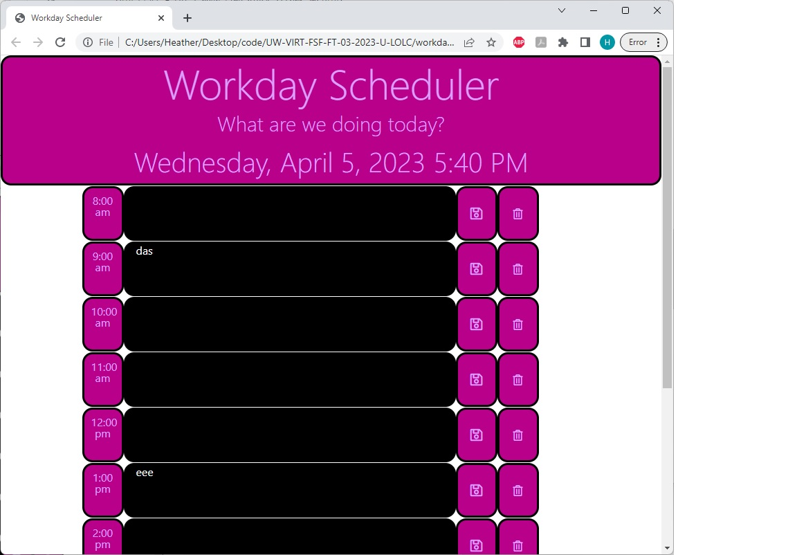
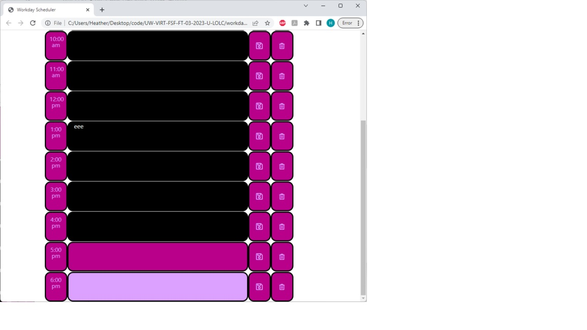

# Workday Scheduler

## Workday Scheduler Description:
This work scheduler displays the title, date and time, in real time, at the top of the screen, with each individual work hour beneath it. The user will be able to enter their work schedule in, hour by hour, save their data, and delete their data. This capability is available for each hour individually, saving their data locally. 

## Workday Scheduler Link:
https://miss-heather.github.io/workdayscheduler/

## Workday Scheduler Visual:

## Workday Scheduler Installation
N/A

## Workday Scheduler Usage
With this Workday Scheduler, the user will be able to schedule their day, hour by hour. The user will be able to save each item and delete items, with functionality available to do so for each hour independently. The user will be able to save items on this application and close out of it, yet be able to go back to it, and have all of their data available to them, as they're saved locally. 

## Workday Scheduler Credits
N/A

## Workday Scheduler License
MIT License

Copyright (c) 2023 miss-heather

Permission is hereby granted, free of charge, to any person obtaining a copy
of this software and associated documentation files (the "Software"), to deal
in the Software without restriction, including without limitation the rights
to use, copy, modify, merge, publish, distribute, sublicense, and/or sell
copies of the Software, and to permit persons to whom the Software is
furnished to do so, subject to the following conditions:

The above copyright notice and this permission notice shall be included in all
copies or substantial portions of the Software.

THE SOFTWARE IS PROVIDED "AS IS", WITHOUT WARRANTY OF ANY KIND, EXPRESS OR
IMPLIED, INCLUDING BUT NOT LIMITED TO THE WARRANTIES OF MERCHANTABILITY,
FITNESS FOR A PARTICULAR PURPOSE AND NONINFRINGEMENT. IN NO EVENT SHALL THE
AUTHORS OR COPYRIGHT HOLDERS BE LIABLE FOR ANY CLAIM, DAMAGES OR OTHER
LIABILITY, WHETHER IN AN ACTION OF CONTRACT, TORT OR OTHERWISE, ARISING FROM,
OUT OF OR IN CONNECTION WITH THE SOFTWARE OR THE USE OR OTHER DEALINGS IN THE
SOFTWARE.
